# 实验一：安装配置你的私有云

## 1、实验目的
1. 初步了解虚拟化技术，理解云计算的相关概念
2. 理解系统工程师面临的困境
3. 理解自动化安装、管理（DevOps）在云应用中的重要性

## 2、实验环境与要求
* 用户通过互联网，使用微软远程桌面，远程访问你在PC机上创建的虚拟机
* 虚拟机操作系统 Centos，Ubuntu，或 你喜欢的 Linux 发行版，能使用 NAT 访问外网。

## 3、实验内容
1. 安装VirtualBox
    * 安装 Git 客户端（git bash）
    * 安装 Oracle VirtualBox 5.X，官方下载
    * 配置 VirtualBox 虚拟机存储位置，避免找不到虚拟机存储位置，特别是消耗启动盘的宝贵空间
        * VirtualBox菜单 ：管理 -> 全局设定，常规页面
    * 创建虚拟机内部虚拟网络，使得 Vbox 内部虚拟机可以通过它，实现虚拟机之间、虚拟机与主机的通讯
        * VirtualBox菜单 ：管理 -> 主机网络管理器，创建一块虚拟网卡，网址分配：192.168.100.1/24

        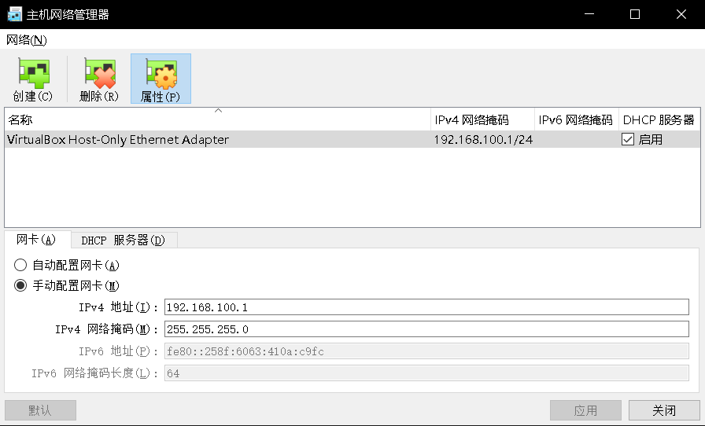

        * 在主机 windows 命令行窗口输入 ipconfig 就可以看到 VirtualBox Host-Only Network #?: 的网卡

        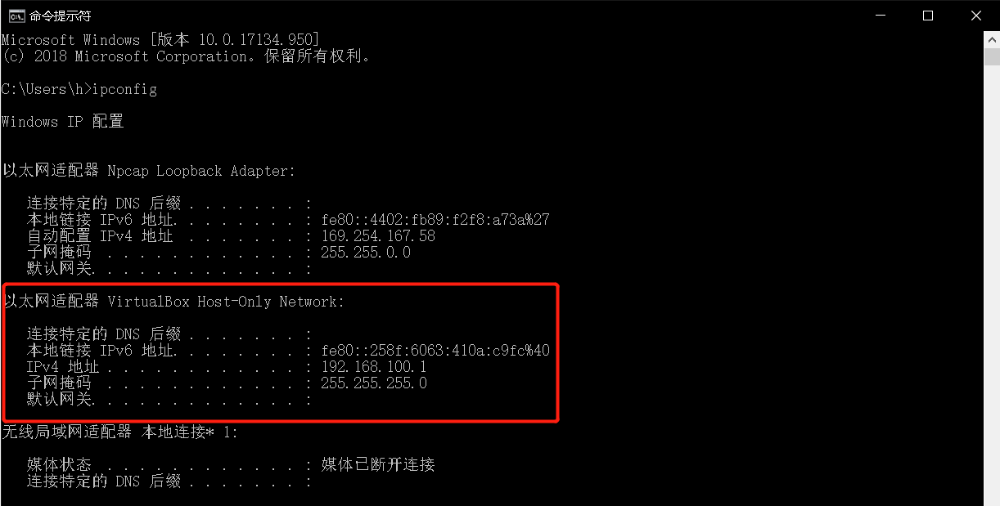

2. 创建Linux虚拟机（CentoOS）
    * 下载 Linux 发行版镜像。
        * 下载 Centos，仅需要 Minimal ISO；（我下载的是华为云的）

        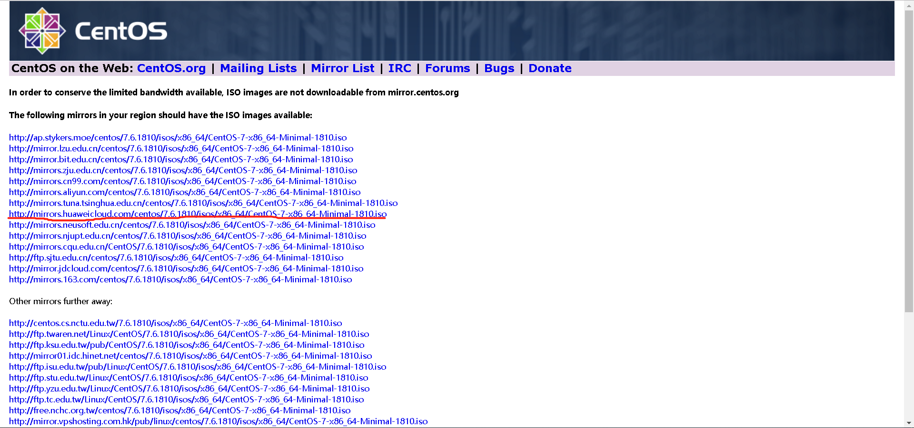

    * 用 VBox 创建虚拟机。 虚拟机名称建议以 centos-xxx 或 ub-xxx 命名
        * 建议虚拟机CPU、内存采用默认。如果是桌面版，CPU建议数1-2，内存不低于2G
        * 显示，显存采用默认。如果是桌面版，显存越大越好。（因为要装图形化界面，所以分配给36MB）

        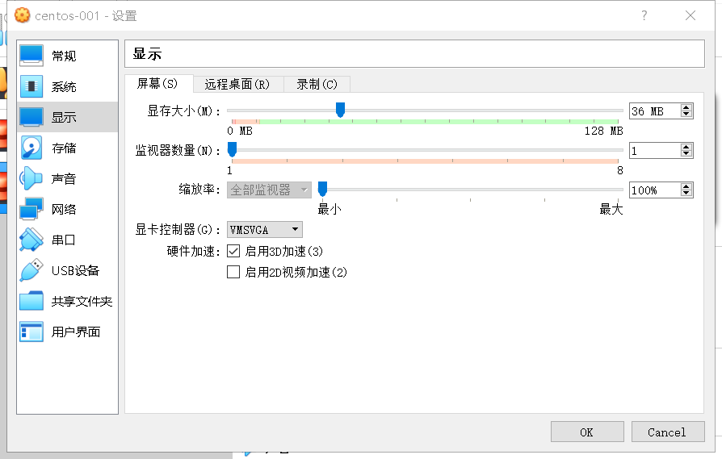

        * 存储，不低于30G。避免以后扩展难。
        * 网络，第一块网卡必须是 NAT；第二块网卡连接方式： Host-Only，接口就是前面创建的虚拟网卡

        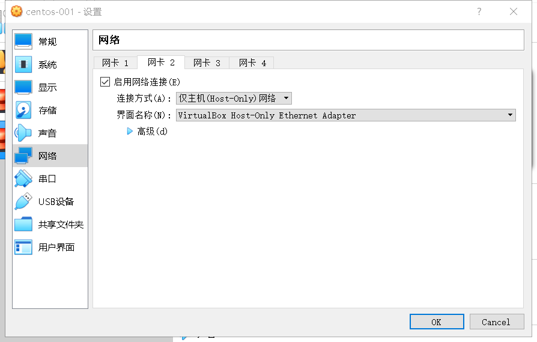

    * 安装 Base 虚拟机，命名为centos-000。 利用虚拟化软件提供的虚拟机复制功能，避免每次安装 OS 系统的痛苦。(之前我都没想到这种方法，这样在以后系统崩了之后，只需要复制而不用重新安装系统那么繁琐)
        * 按提示安装，直到完成
        * 升级 OS 系统内核
        * 获取 wget, yum install wget
        * 升级 OS内核， yum update
        * 检查网卡配置
        * 配置网络的UI界面 nmtui，配置第二块网卡地址
            
            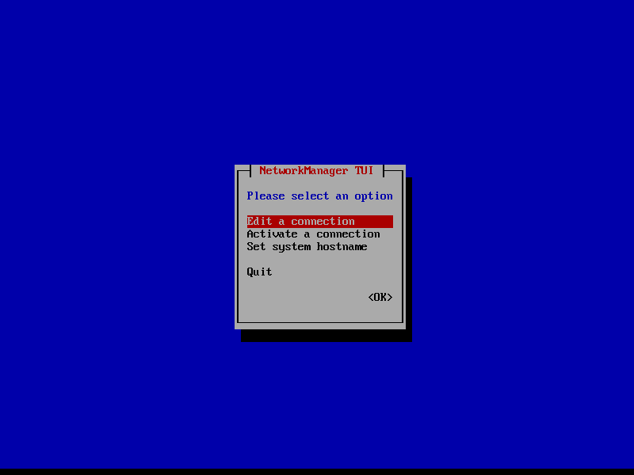

            1. 先配置第二块网卡的IP地址

            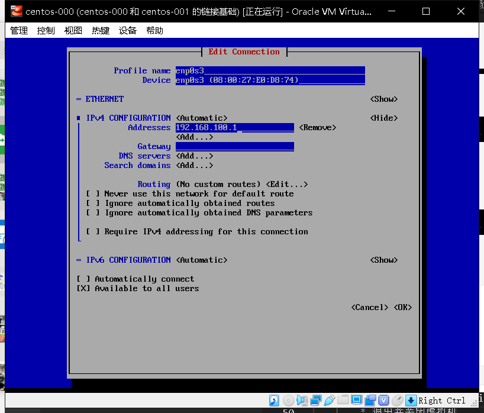

            2. 然后要activate两个网卡，不然用不了

            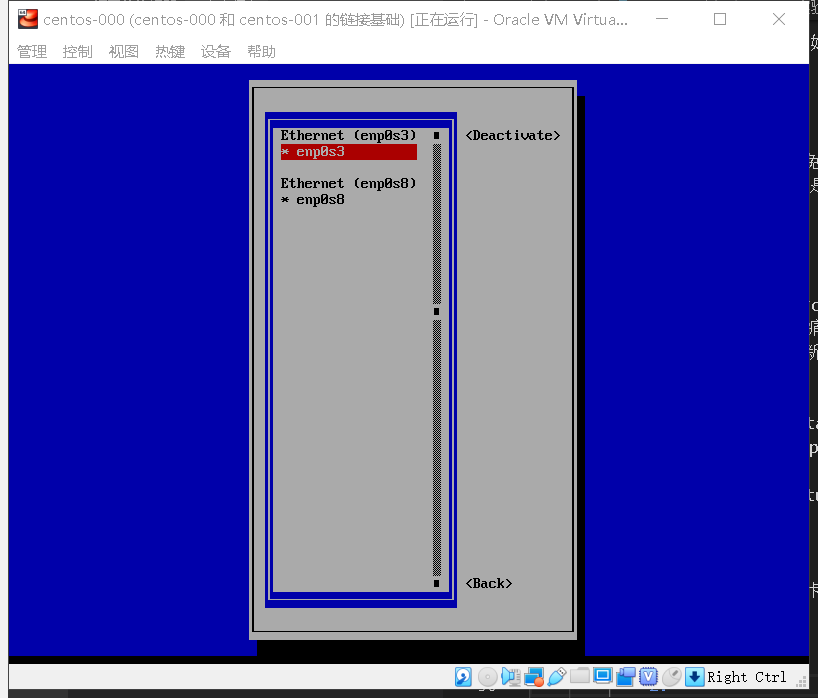

        * ping 主机，例如： ping 192.168.100.1

        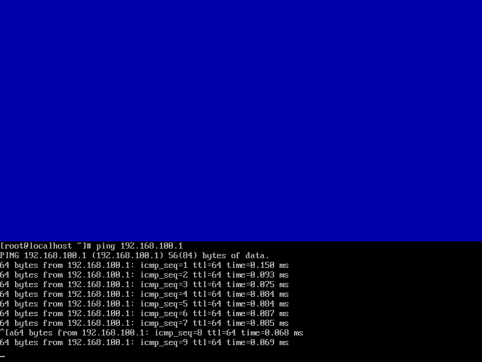

        * 退出并关闭虚拟机

    * 安装虚拟机
        * 点击 centos-base 选择复制，输入新虚拟机的名，注意必须 选择重新初始化所有网卡的 MAC 地址
        * 然后选 链接复制
        * 配置主机名和第二块网卡（与上面一样）
        * 使用 nmtui 修改主机名和第二块网卡IP地址（与上面一样）
        * 重启
        * 在主机上，应能 ping 到这个地址，且能通过 ssh 访问该虚拟机（windows 需启动 git bash）

        * 如果你使用 centos 桌面
            * 重新配置虚拟机 CPU，内存，显存
                * 这里主要是显存要配得大一点
            * 启动虚拟机
            * 安装桌面 yum groupinstall "GNOME Desktop"
                * 安装好之后，输入命令startx进入到图形化界面，我没有配置默认进入图形化，为了以后能在命令行界面配置一些东西
            * 重启
            * 安装 VirtualBox 增强功能
                1. 通过VirtualBox的 设备 | 安装增强功能加载VBoxGuestAdditions.iso

                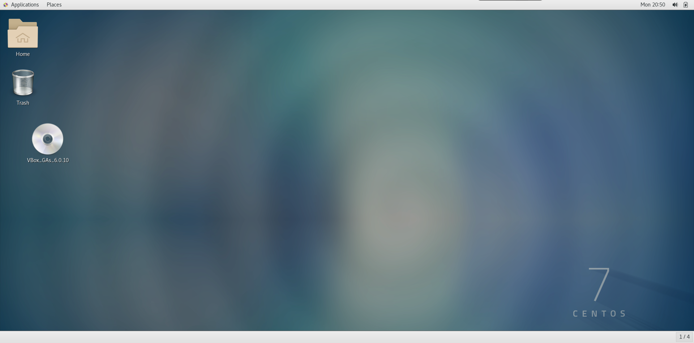

                2. 点击光盘，并在此目录下终端中输入

                    ```sh ./VBoxLinuxAdditions.run```

                3. 一般都会报错，所以需要安装与Linux内核版本匹配的kernel-devel，安装之后重新安装增强功能

                4. 安装增强功能之后，就可以鼠标随意切换、共享文件以及粘贴板等
3. 配置用远程桌面访问你的虚拟机
    * 参考：[如何设置VirtualBox虚拟机远程访问模式](https://www.jianshu.com/p/6f0f35fa2c4f)
        1. 首先需要先在官网下载扩展功能
        2. 然后配置端口为5005（只要不同主机配置不同端口就行，还要尽量大避免冲突）

        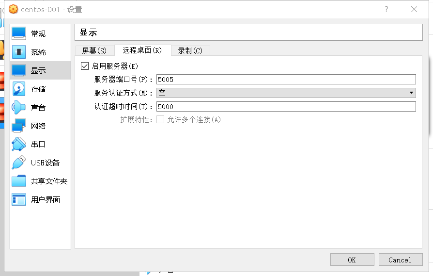

    * 虚拟机无界面启动，用户即可通过网络，使用RDP客户端访问
        1. 打开远程桌面连接

        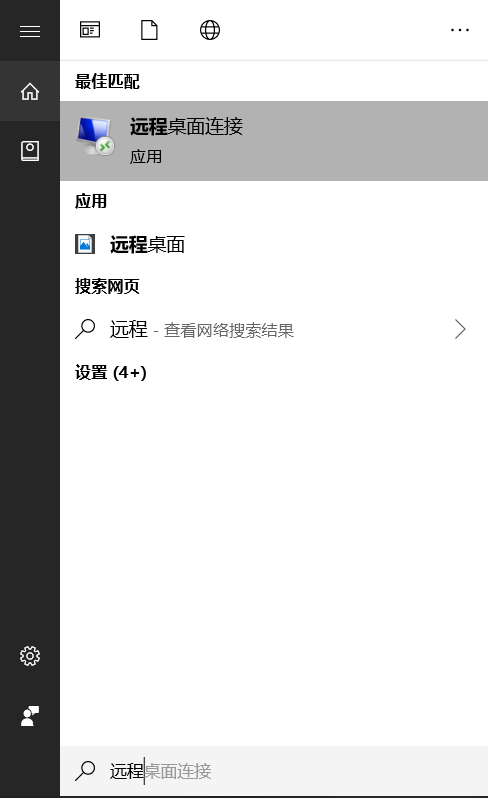

        2. 通过192.168.100.1:5005来连接，192.168.100.1就是之前配置的虚拟网卡的地址

        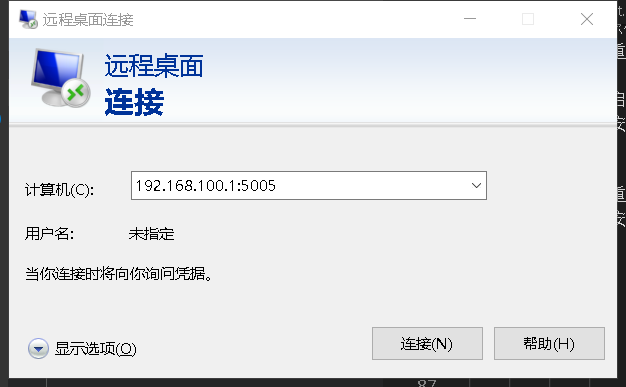

        3.成功连接

        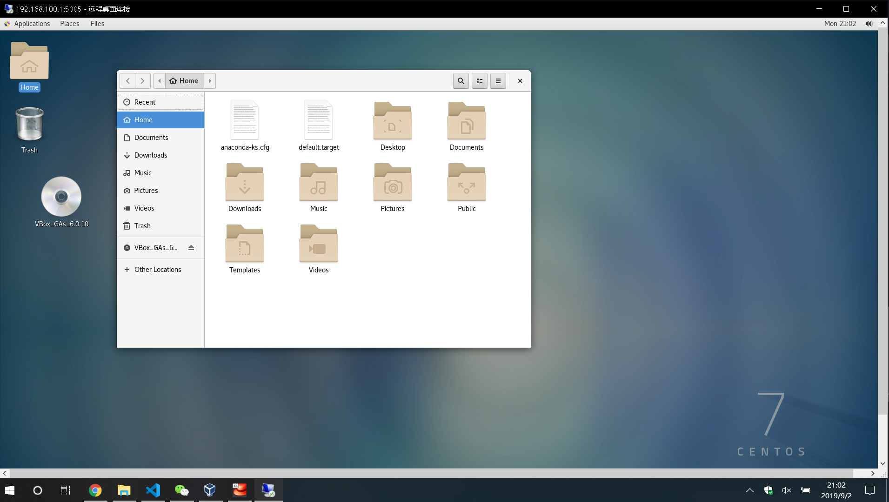

## 3、实验总结
该实验的难度并不大，毕竟我是跟着教程的centOS。但其中还是有些坑的，比如教程中nmtui配置网络的时候，并没有说到要activate两个网卡，如果不activate是不能使用网络的。除此之外，过程都挺顺畅。