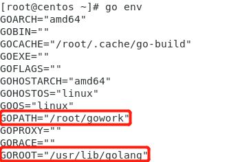
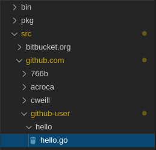
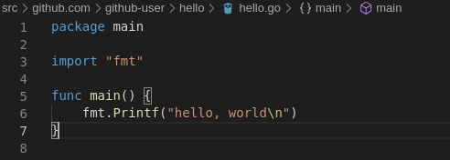
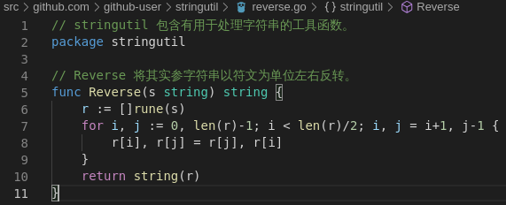
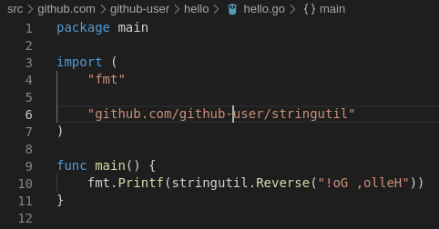
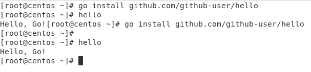
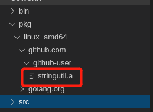
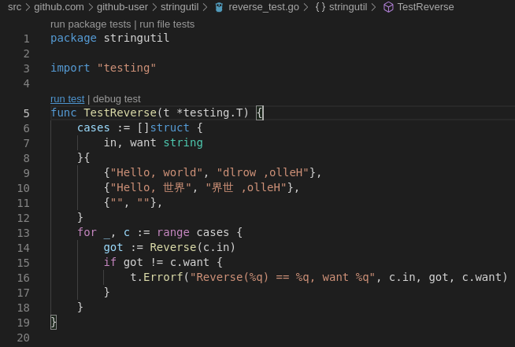
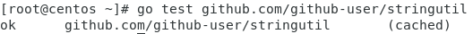

## Go 开发环境安装之测试

### 先要创建工作空间

go 工具为公共代码仓库中维护的开源代码而设计。 无论你会不会公布代码，该模型设置工作环境的方法都是相同的。

Go代码必须放在工作空间内。它其实就是一个目录，其中包含三个子目录：

* src 目录包含Go的源文件，它们被组织成包（每个目录都对应一个包），
* pkg 目录包含包对象，
* bin 目录包含可执行命令。

所以首先创建我自己的工作空间，我将其命名为gowork。并用以下语句将环境变量配置好。
```
$ export GOPATH=$HOME/gowork
$ export PATH=$PATH:$GOPATH/bin
```

不过为了使CentOS系统记住该配置，需要把上述语句拷贝到```/etc/.profile```中，然后执行这些配置。
```
$ source /etc/.profile
```

使用```go env```查看是否成功配置。



最后为我接下来的编程以及测试创建目录。
```
$ mkdir $GOPATH/src/github.com/github-user/hello -p
```

### 我的第一个程序

开始第一个程序之前，我们先检查一下工作空间的目录空间是否符合规范，然后再检查```$GOPATH/src/github.com/github-user/hello```目录。



在hello.go文件中进行编码。



在hello目录下，可以使用go run直接运行。
```
$ go run hello.go
hello, world
```

或者使用go install安装此程序，并使用hello运行它。
```
$ go install github.com/github-user/hello
$ hello
```

### 我的第一个库

为我的包创建目录。
```
$ mkdir $GOPATH/src/github.com/github-user/stringutil
```

创建一个名为reverse.go的文件，这个文件内的大写字母开头的函数将会被其他包import使用。然后进行编辑：



现在用 go build 命令来测试该包的编译，这不会产生输出文件，即不会将包的对象放到工作空间的 pkg 目录中，只是进行编译以测试是否可用。
```
$ go build github.com/github-user/stringutil
```

然后我们在hello.go中尝试使用一下它（第二次我改了，使得“Hello, Go!”会换行）。





果然在pkg目录下出现了包对象！



### 学习如何测试

> Go拥有一个轻量级的测试框架，它由 go test 命令和 testing 包构成。  

>你可以通过创建一个名字以 _test.go 结尾的，包含名为 TestXXX 且签名为 func (t *testing.T) 函数的文件来编写测试。 测试框架会运行每一个这样的函数；若该函数调用了像 t.Error 或 t.Fail 这样表示失败的函数，此测试即表示失败。

首先通过```$GOPATH/src/github.com/github-user/stringutil/reverse_test.go```创建测试文件，这里是测试reverse.go的，其中的函数TestReverse测试Reverse函数。



这里的测试是这样的，使用一个struct结构体包含三种测试用例，然后通过检测Reverse的输出是否符合want，不符则调用t.Errorf报错。



这样也就完成了测试的学习。

### 总结

这次实验通过查看[如何使用Go编程](https://go-zh.org/doc/code.html)学习了go编程的基础，学会了go项目的目录结构，还有如何编译运行以及测试这些在开始真正进行go开发所必需的知识。个人非常喜欢这种规范化，能让编程开发更加井井有条。在此之前，我为了搭建这个环境也花费了不少功夫，所以我也写了一篇博客来描述所遇到的坑——[]()。接下来，要进行真正的go语言编程了。


