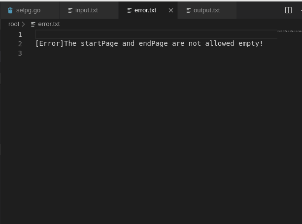

## CLI 命令行实用程序开发基础

### 简介
CLI（Command Line Interface）实用程序是Linux下应用开发的基础。正确的编写命令行程序让应用与操作系统融为一体，通过shell或script使得应用获得最大的灵活性与开发效率。Linux提供了cat、ls、copy等命令与操作系统交互；go语言提供一组实用程序完成从编码、编译、库管理、产品发布全过程支持；容器服务如docker、k8s提供了大量实用程序支撑云服务的开发、部署、监控、访问等管理任务；git、npm等都是大家比较熟悉的工具。尽管操作系统与应用系统服务可视化、图形化，但在开发领域，CLI在编程、调试、运维、管理中提供了图形化程序不可替代的灵活性与效率。

而本次实验我需要开发selpg，这个名称代表 SELect PaGes。selpg 允许用户指定从输入文本抽取的页的范围，这些输入文本可以来自文件或另一个进程。命令格式如下：
```selpg -s startPage -e endPage [-l linePerPage | -f] [-d dest] input_file [>output_file] [2>error_file]```

具体详细请看：[开发 Linux 命令行实用程序 ](https://www.ibm.com/developerworks/cn/linux/shell/clutil/index.html)

### 设计说明
1. 参数解析  
在执行命令之前，我们先要对其后的参数进行解析，也就是读取参数并绑定到我所定义的结构体上去，以方便我进一步的执行工作。在这一步骤中，为了满足 Unix 命令行规范，我根据作业要求使用了pflag，需要输入```go get github.com/spf13/pflag```安装pflag库，并在go文件中```import flag "github.com/spf13/pflag"```。然后如同下方代码，使用IntVarP等函数进行参数绑定，我们可以对参数设置shorthand。
```
func get(args *selpgArgs) { //Parsing args in commands
	//Bind flag to selpgArgs struct
	flag.IntVarP(&args.startPage, "startpage", "s", -1, "Start page")
	flag.IntVarP(&args.endPage, "endpage", "e", -1, "End page")
	flag.IntVarP(&args.linePerPage, "lines", "l", 72, "Lines per page")
	flag.BoolVarP(&args.pageType, "flag", "f", false, "Whether paging by paging break")
	flag.StringVarP(&args.dest, "destionation", "d", "", "Print destionation")

	flag.Usage = func() {
		fmt.Fprintf(os.Stderr,
			"\nUSAGE: %s -s startPage -e endPage [-l linePerPage | -f] [-d dest] input_file [>output_file] [2>error_file]\n", os.Args[0])
		flag.PrintDefaults()
	}

	flag.Parse()

	//Get the file name
	if len(flag.Args()) == 1 {
		args.filename = flag.Args()[0]
	} else {
		args.filename = ""
	}
}
```
什么是shorthand？也就是该参数的缩写名，如下图，使用--需要打出参数的全名，而-可以使用其缩写。  


2. 处理参数错误  
在获得了参数后，需要对参数进行分析，如果参数不符合规范需要退出程序。这里检查了有如参数为空，未输入首页或末页以及同时输入了-l和-f等错误，当然这些错误检查不够完整，可以进一步改进。
```
func processArgs(args *selpgArgs) { //Processing input errors
	if args == nil {
		fmt.Fprintln(os.Stderr, "\n[Error]The args is nil!")
		os.Exit(1)
	} else if args.startPage == -1 || args.endPage == -1 {
		fmt.Fprintln(os.Stderr, "\n[Error]The startPage and endPage are not allowed empty!")
		os.Exit(2)
	} else if args.startPage < 0 || args.startPage > (math.MaxInt32-1) {
		fmt.Fprintln(os.Stderr, "\n[Error]The startPage is invalid!")
		os.Exit(3)
	} else if args.endPage < 0 || args.endPage > (math.MaxInt32-1) {
		fmt.Fprintln(os.Stderr, "\n[Error]The endPage is invalid!")
		os.Exit(4)
	} else if args.pageType != false && args.linePerPage != 72 {
		fmt.Fprintln(os.Stderr, "\n[Error]-f and -l are not allowed to exist at the same time!")
		os.Exit(5)
	}
}
```

3. 读取输入文件内容  
确认参数无误后，就要根据参数读取输入文件中的数据，并将数据或打印在标准输出，或打印到输出文件中。而读取文件时，又要根据-f或-l来确定读取数据的分页方式。-f是根据分页符分页，-l则根据输入的参数确定多少行一页。读取文件时，我使用了bufio库了的Scanner，Scanner包含了Split能自定义函数以根据分页符分割数据，读取的数据还用buf存下。
```
//Page files
	var buf []string
	scanner := bufio.NewScanner(fin)
	if !args.pageType {
		//-l类型
		count := 0
		for scanner.Scan() {
			line := scanner.Text()
			if count/args.linePerPage == args.endPage {
				break
			}
			if count/args.linePerPage+1 >= args.startPage {
				buf = append(buf, line)
			}
			count++
		}
	} else {
		//-f类型
		count := 0
		onSp := func(data []byte, atEOF bool) (advance int, token []byte, err error) {
			for i := 0; i < len(data); i++ {
				if data[i] == '\f' {
					return i + 1, data[:i], nil
				}
			}
			if atEOF {
				return 0, data, bufio.ErrFinalToken
			}
			return 0, nil, nil
		}
		scanner.Split(onSp)
		for scanner.Scan() {
			line := scanner.Text()
			if count == args.endPage {
				break
			}
			if count+1 >= args.startPage {
				buf = append(buf, line)
			}
			count++
		}
	}
```

4. 输出到输出文件  
如果没有收到输出文件，那么就把数据打印到标准输出上。如果有，就需要把数据打印到输出文件中，这里使用了os/exec库的Command来将数据用管程输出到一个执行命令上（这里我是把输出文件作为命令）。
```
//Output contents of the file
	if args.dest == "" {
		//Output to stdout
		for _, v := range buf {
			fmt.Fprintln(os.Stdout, v)
		}
	} else {
		//Output to a file
		cmd := exec.Command("./" + args.dest)
		inpipe, err := cmd.StdinPipe()
		if err != nil {
			fmt.Println(err)
			os.Exit(1)
		}
		defer inpipe.Close()
		cmd.Stdout = os.Stdout
		cmd.Stderr = os.Stderr
		cmd.Start()

		for _, v := range buf {
			inpipe.Write([]byte(v))
		}
	}
```

### 测试
首先，我提前用程序创建了一个文件input.txt，并往里面输入了1到10000（一个数字换一次行）。然后按照[文档](https://www.ibm.com/developerworks/cn/linux/shell/clutil/index.html)的**使用 selpg 章节**要求测试程序。(由于输出较多，我只截取比较有代表性的进行展示)
cat
1. ```$ selpg -s1 -e1 input_file```   
输出了第一页，也就是72行到标准输出。


2. ```$ selpg -s1 -e1 < input_file```  
与1一样，输出了第一页，也就是72行到标准输出。但在本例中，selpg 读取标准输入，而标准输入已被 shell／内核重定向为来自“input_file”而不是显式命名的文件名参数。


3. ```$ other_command | selpg -s10 -e20```  
使用cat input.txt将此文件中的所有数据输出到selpg指令中，然后打印此输出的10到20页。


4. ```$ selpg -s10 -e20 input_file >output_file```  
将数据输出到另一个文件中，可以在output.txt中看到输出。


5. ```$ selpg -s10 -e20 input_file 2>error_file```  
这里我故意漏掉-e参数，报错信息没有直接输出到标准输出，而是打印到了error.txt当中。



6. ```$ selpg -s10 -e20 input_file >output_file 2>error_file```  
数据输出打印到output.txt（这里由于报错，输出文件没有打印任何信息），错误信息打印到了error.txt当中。


7. ```$ selpg -s10 -e20 input_file >output_file 2>/dev/null```  
数据输出打印到output.txt（这里由于报错，输出文件没有打印任何信息），错误信息被抛弃（设备文件 /dev/null 废弃所有写至它的输出）


8. ```$ selpg -s10 -e20 input_file >/dev/null```  
输出被抛弃掉，所以标准输出没打印任何信息


9. ```$ selpg -s10 -e20 input_file | other_command```  
该命令统计给定文件中的行数、字数、字节数。这里受到了标准输入，所以计算输出的行数、字数、字节数（行数为792，为11行*72）。


10. ```$ selpg -s10 -e20 input_file 2>error_file | other_command```  
与9一样，不够错误信息会被打印到error.txt，这里命令无异常。


11. ```$ selpg -s10 -e20 -l66 input_file```  
这里将每页行数设置为66行，所以输出到20 * 66 = 1320即结束。


12. ```$ selpg -s10 -e20 -f input_file```  
以分页符分页，不够我没有在input.txt写分页符'\f'，所以没有第10页到20页这些，只有第一页的10000行。


13. ```$ selpg -s10 -e20 -dlp1 input_file```  
该命令将使输出在名为“lp1”的打印机上打印，也就是测试-d参数，但是我没有连接打印机，这里无法展示。


14. ```$ selpg -s10 -e20 input_file > output_file 2>error_file &```
这条命令使selpg 进程在后台运行，完成后会返回完成信息。同时使用ps可以检查它是否仍在运行或已经完成。没有在进程表中看到17601，说明已完成。


### 总结
本次实验，实现了类似Linux命令行的一种简单功能的命令行selpg，也就是实现从文件中提取指定数量的页，页可以由用户自定义。实现了这样一个命令行，首先是进一步熟悉了golang一些包的使用，如os，pflag等，使用上并不难，翻看官方文档就能了解使用方法。同时因为使程序符合规范，还对Unix命令行规范有了一定的了解。